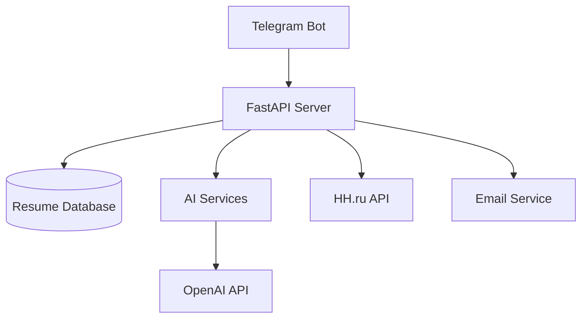
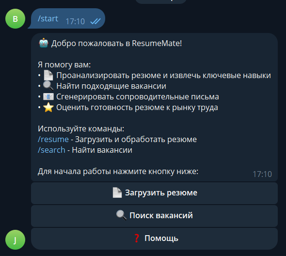
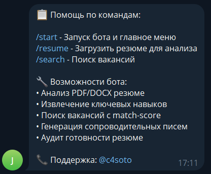
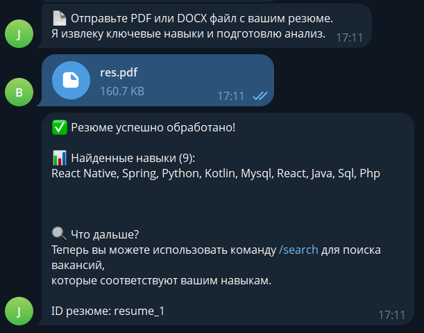
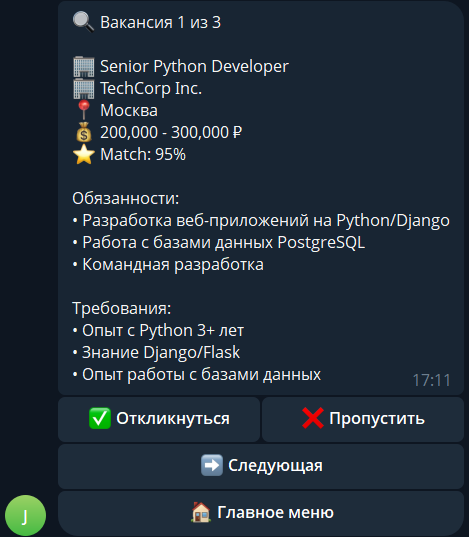

# 🤖 ResumeMate

<div align="center">
  <h3>AI-Powered Telegram Bot for Resume Analysis and Job Search</h3>
  <p><strong>Automate your job search process with Artificial Intelligence</strong></p>

  
  
  
  
  

  ⚠️ **Warning:** This is a demo version and basic solution prototype. Not intended for production use.
</div>

---

## 🚨 Important Warning

<div align="center" style="background-color: #fff3cd; border: 1px solid #ffeaa7; border-radius: 8px; padding: 20px; margin: 20px 0;">

### ⚠️ DEMO PROJECT

**This is not a complete product, but a demonstration prototype of the solution.**

- 🔧 Basic functionality to demonstrate the concept
- 📝 Not intended for real production use
- 🧪 Suitable for learning and testing ideas
- 🚫 Not recommended for serious use

</div>

---

## ✨ Key Features

<table>
  <tr>
    <td width="50%">
      <h3>📄 Resume Analysis</h3>
      <ul>
        <li>PDF and DOCX format support</li>
        <li>Automatic skill extraction</li>
        <li>Job market readiness assessment</li>
        <li>Improvement recommendations</li>
      </ul>
    </td>
    <td width="50%">
      <h3>🔍 Job Search</h3>
      <ul>
        <li>Smart match-score algorithm</li>
        <li>Integration with HH.ru API</li>
        <li>Pagination and easy navigation</li>
        <li>Skills-based filtering</li>
      </ul>
    </td>
  </tr>
  <tr>
    <td width="50%">
      <h3>📧 Cover Letters</h3>
      <ul>
        <li>Personalized generation</li>
        <li>LLM integration (optional)</li>
        <li>Human-in-the-loop control</li>
        <li>Email integration</li>
      </ul>
    </td>
    <td width="50%">
      <h3>⭐ Resume Audit</h3>
      <ul>
        <li>A-E scale assessment</li>
        <li>Specific recommendations</li>
        <li>ATS compatibility analysis</li>
        <li>Optimization suggestions</li>
      </ul>
    </td>
  </tr>
</table>

---

## 🛠 Technologies

<div align="center">

### Backend


### Bot Development


### Document Processing


### Deployment & DevOps


</div>

### Project Architecture



---

## 🚀 Quick Start

<div align="center" style="background-color: #f8f9fa; border: 1px solid #dee2e6; border-radius: 8px; padding: 15px; margin: 20px 0;">

### 📋 Demo Version for Testing

This project is intended exclusively for concept demonstration and learning. Do not use in production or for real tasks.

</div>

### Prerequisites

- **Python 3.8+**
- **Telegram Bot Token** (get from [@BotFather](https://t.me/botfather))

### Installation

```bash
# 1. Clone the repository
git clone https://github.com/yourusername/resumemate.git
cd resumemate

# 2. Run automatic setup
python setup.py

# 3. Configure environment variables
cp .env.example .env
# Edit .env file with your TELEGRAM_BOT_TOKEN
```

### ⚠️ Important Warnings Before Launch

<div align="center" style="background-color: #fff3cd; border-left: 4px solid #ffc107; padding: 15px; margin: 15px 0;">

**Before launching, make sure:**

- The project is intended only for demo and learning
- Do not use for real resumes or job postings
- Production will require security improvements
- Store tokens and keys securely

</div>

### Launch

```bash
# Terminal 1: FastAPI server
python run_api.py

# Terminal 2: Telegram bot
python run_bot.py
```

<div align="center">
  
</div>

---

## 📖 Usage

<div align="center" style="background-color: #e7f3ff; border: 1px solid #b3d9ff; border-radius: 8px; padding: 15px; margin: 20px 0;">

### 🎯 Demo Mode

The project operates in demonstration mode with limited functionality. Use only for testing and learning.

</div>

### Workflow

<div align="center">
  
</div>

### Bot Commands

| Command | Description |
|---------|-------------|
| `/start` | 🚀 Start the bot and main menu |
| `/resume` | 📄 Upload resume for analysis |
| `/search` | 🔍 Search for jobs by skills |

### Usage Examples

#### Resume Analysis
<div align="center">
  
</div>

#### Job Search
<div align="center">
  
</div>

<div align="center" style="background-color: #f8f9fa; border: 1px solid #dee2e6; border-radius: 8px; padding: 15px; margin: 20px 0;">

**⚠️ Note:** All usage examples are for demonstration purposes. Real functions may differ from those described.

</div>

---

## 🔧 API Documentation

After launching the server, documentation is available at:
**http://localhost:8000/docs**

### Main Endpoints:

#### `POST /upload-resume`
Upload and process resume

#### `POST /extract-skills`
Extract skills from text

#### `GET /health`
Health check

---

## 🏗 Project Structure

```
ResumeMate/
├── 📄 main.py              # FastAPI server
├── 🤖 bot.py               # Telegram bot
├── 🔧 jobs.py              # Job search and analysis services
├── ⚙️ setup.py             # Automatic setup
├── 🚀 run_api.py           # API launch script
├── 🤖 run_bot.py           # Bot launch script
├── 📋 requirements.txt     # Python dependencies
├── 🔐 .env.example         # Configuration example
├── 📄 README.md            # Documentation
└── 📄 LICENSE              # License
```

---

## 📊 Competitive Advantages

| Feature | ResumeMate | Competitors |
|---------|------------|-------------|
| 🤖 AI Resume Analysis | ✅ Complete | ❌ Limited |
| 🔍 Smart Job Search | ✅ With match-score | ❌ Basic |
| 📧 LLM Cover Letters | ✅ Personalized | ❌ Template-based |
| ⭐ Resume Audit | ✅ With recommendations | ❌ Simple assessment |
| 🎯 Human-in-the-loop | ✅ Final confirmation | ❌ Automatic sending |

---

## 📞 Contacts

**Developer:** Vladislav Skrauch

<div align="center">

[](https://t.me/worksoto)
[](mailto:vlskrauch@mail.ru)

</div>

### For Commercial Use
📧 **Email:** vlskrauch@mail.ru
📱 **Telegram:** @worksoto

---

## 📄 License

The project is distributed under a **custom license**. Details in the [LICENSE](LICENSE) file.

**Important:** It is forbidden to attribute the development to yourself and use for commercial purposes without written permission from the author.

---

<div align="center">

### ⭐ If you like the project, give it a star!

**Good luck with your job search! 🚀**

*Made with ❤️ for the developer community*

</div>

---

<div align="center" style="background-color: #fff3cd; border: 2px solid #ffeaa7; border-radius: 10px; padding: 25px; margin: 30px 0; font-size: 18px;">

## 🚨 FINAL WARNING

**This is a demo project created exclusively to demonstrate technical skills and solution concept.**

❌ **Do not use for real tasks**<br>
❌ **Do not upload confidential information**<br>
❌ **Do not apply in production environment**<br>
✅ **Use only for learning and testing**

For a complete solution, contact the developer to create a production version.

</div>
